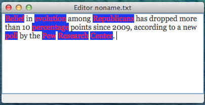

hanshi
======

a text editor that tags the part of speech as you type.

* We are using the example text editor from the WxPython getting started guide:
  http://wiki.wxpython.org/Getting%20Started#Small_editor_-_Complete_Source

* requires WxPython "easy_install wxPython" or "brew install wxPython"

* For part-of-speech tagging, we use Kyle Gorman's port of Eric Brill's rule based tagger:
  https://github.com/kylebgorman/pposttl

Highlighting nouns:

  
